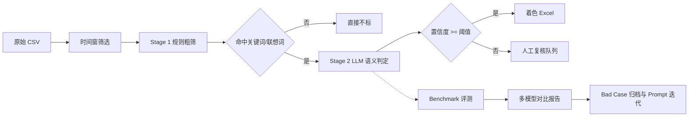

# Beer Sentiment Pipeline

啤酒行业负面舆情双阶段筛选管线：先基于品牌词库与关键词做规则粗筛，再让大模型对候选行做语义判定，输出带本品蓝 / 竞品与行业黄标记的 Excel；同时内置人工标注 Benchmark、多模型评测、Bad Case 归档和实验报告生成。

项目面向真实业务场景设计：原始 CSV 来自夸克抓取的全网啤酒行业帖子，噪声大、口语化强、OCR 错字多，且"命中关键词"不等于负面舆情。仓库只保留脱敏样例数据与合成 Benchmark，不包含真实抓取数据。

## 架构



## 快速开始

```bash
pip install -e ".[dev]"

# 无 API Key 即可跑通：使用规则 Mock 模型
beer-sentiment run \
  --input-dir data/samples \
  --output-dir object \
  --session morning \
  --date 2026-08-24 \
  --model mock

# 在 Benchmark 上评测并生成报告
beer-sentiment eval --model mock

# 对比多个模型（需要配置 API Key）
beer-sentiment eval --models mock,deepseek-v4,qwen-max,kimi-k3
```

也可保留人工复核路径：

```bash
beer-sentiment prepare --input-dir original --session morning --date 2026-08-24
beer-sentiment build --review-csv 待筛选_上午.csv --session morning
```

## 目录结构

```text
beer-comment-analysis/
├── benchmark/                 # 人工标注 Benchmark（脱敏子集）
├── config/                    # 品牌、关键词、Pipeline、模型配置
├── prompts/                   # 版本化判定 Prompt
├── data/samples/              # 可公开的演示数据
├── src/beer_sentiment/
│   ├── rules/                 # Stage 1：OCR 归一化、品牌匹配、候选筛选
│   ├── llm/                   # Stage 2：Mock / OpenAI 兼容模型、结构化输出
│   ├── pipeline/              # 两阶段流水线与端到端运行
│   ├── eval/                  # Benchmark、指标、实验报告
│   └── io/                    # CSV/Excel、时间窗、文件命名
├── tests/                     # pytest 单测与端到端测试
└── artifacts/                 # 评测运行日志与报告（不入库）
```

## 判定规则

- 本品负面（百威、哈啤、哈尔滨、科罗娜、雪津）标蓝。
- 竞品负面（青岛、雪花、乌苏、喜力、RIO、乐堡）与行业整体负面标黄。
- 必须合并 `正文 / 封面OCR / 内容OCR / 标题` 阅读，不能只看单列。
- 关键词只用于提醒：教学辟谣、商家对比宣传、个人体验、第三方仿冒、回忆过去等命中关键词的内容不标。
- 低置信度样本不自动标色，进入人工复核队列。

## 评测指标

`eval` 会输出准确率、宏平均 F1、负面检测精确率 / 召回率 / F1、误报率、漏报率、混淆矩阵、平均延迟与成本，并按 `artifacts/runs/` 归档每次实验（模型、Prompt 版本、配置哈希、指标、Bad Case）。多模型评测会额外生成 `artifacts/reports/model_compare.md` 对比表。

## 接入真实模型

`config/models.yaml` 已预留 DeepSeek-V4、Qwen-Max、Kimi-K3 三个 OpenAI 兼容接口占位。接入时在环境变量中配置对应 `api_key_env`，并确认 `base_url / model / 单价` 与账号一致：

```bash
export DEEPSEEK_API_KEY=...
export DASHSCOPE_API_KEY=...
export MOONSHOT_API_KEY=...
```

## 路线图

- [x] M1：工程化骨架、配置、测试、CI、演示数据
- [x] M2：LLM 判定抽象、Benchmark、评测报告
- [ ] M3：Hybrid RAG（BM25 + Dense + RRF + Cross-Encoder）与 Bad Case 自动回灌
- [ ] M4：Streamlit 演示页与自动化调度

## 说明

仓库内 Benchmark 为脱敏合成子集，用于复现评测链路；完整私有标注集与真实抓取数据不提交。模型名与价格仅为占位配置，请按实际账号调整。
