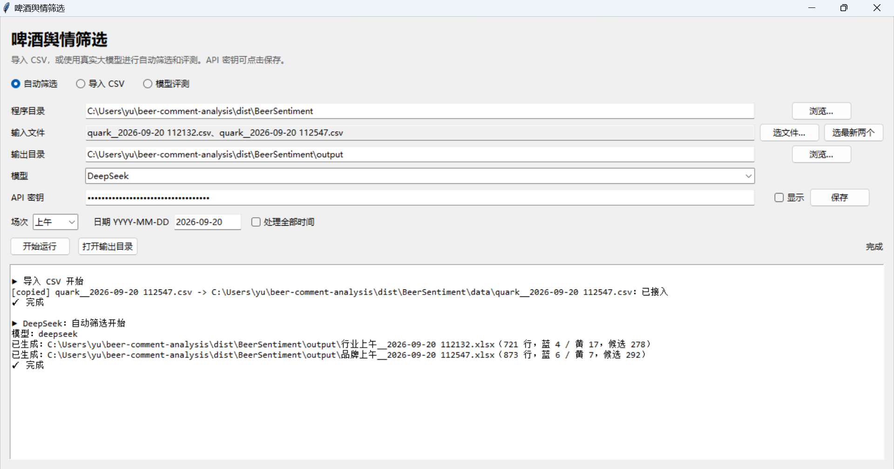
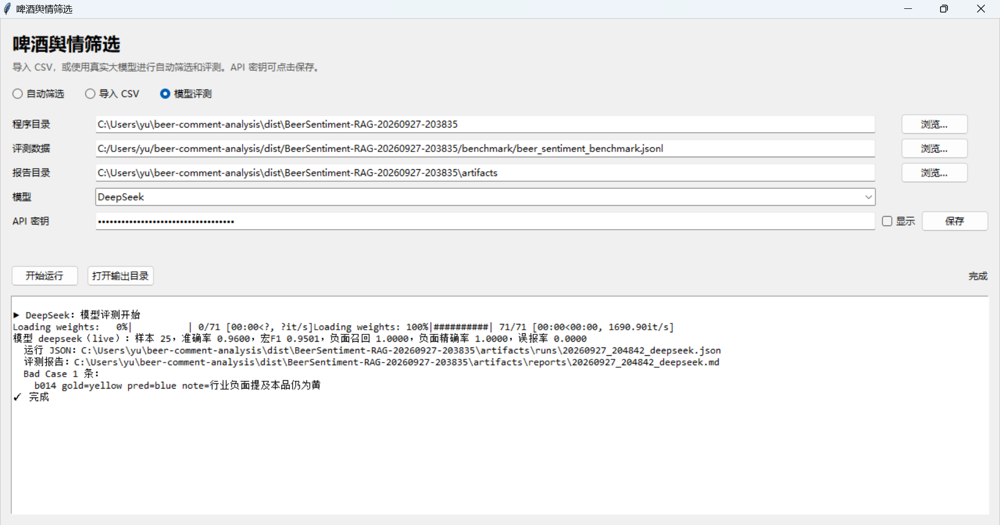

# Beer-Comment-Analysis-LLM-Powered-Sentiment-Filter

## Overview

本项目用于筛选啤酒行业负面舆情。原始数据是从夸克等渠道导出的帖子 CSV，程序本身不负责抓取或连接数据平台。它先用品牌词、关键词、拼音别名及错字匹配粗筛，再交由大模型结合标题、正文和 OCR 内容判断，输出带颜色标记的 Excel：本品负面为蓝色，竞品或行业负面为黄色。低置信度结果可由人工复核。

完整流程是：导入 CSV → 按日期、场次筛选并进行规则粗筛 → 为候选帖子检索相关判定规则与示例 → 大模型判断 → 人工复核低置信度结果 → 生成着色 Excel。未进入候选集的帖子不会逐条调用大模型。

## Features

Windows 桌面界面提供“导入 CSV”“自动筛选”“模型评测”三种模式。可一次选择多个 CSV，自动筛选默认选取最近导入的两个文件；按日期和上午、下午场次处理，也可勾选“处理全部时间”。自动筛选支持 DeepSeek、Qwen、Kimi；知识库检索结合 BM25（检索前会修正常见 OCR 错字）与 Embedding 语义检索，随后用 RRF 融合两路结果，选出与帖子相关的规则和示例，连同帖子提供给大语言模型。评测读取本地标注数据，生成准确率、宏平均 F1、负面识别指标等报告，并记录误判样本，方便回看和调整规则。界面中的 API 密钥可保存，保存时使用当前 Windows 用户的 DPAPI 加密。

## Screenshots

自动筛选完成后的界面：



模型评测完成后的界面：



## Quick Start

在项目根目录安装依赖并启动桌面界面：

```powershell
python -m pip install -e ".[llm,rag]"
python -m beer_sentiment.gui
```

选择 CSV、模型并填写对应的 API 密钥后即可运行。源文件可通过界面导入，结果写入所选输出目录；运行日志会显示处理文件与生成路径。也可使用命令行：

```powershell
beer-sentiment run --input-dir data --output-dir output --all-time --model deepseek
```

Windows 打包需另装 `pyinstaller`，再执行 `scripts/build_windows.ps1`。脚本还要求本地真实评测集和已缓存的 `bge-small-zh-v1.5` 模型，重新打包前应保留本地数据与输出文件。

## Repository

`src/beer_sentiment/` 是核心代码目录：`rules/` 负责品牌识别与粗筛，`rag/` 检索知识库，`pipeline/` 串联处理步骤，`llm/` 对接模型并解析结果，`io/` 读写 CSV 与 Excel，`eval/` 生成评测指标和报告，`gui.py` 是桌面界面入口。项目根目录的 `config/` 管理品牌词、模型和流程参数，`prompts/` 存放判断提示词，`tests/` 包含自动化测试；`benchmark/beer_sentiment_benchmark.jsonl` 是用于公开示例和测试的合成样本。

真实采集的 CSV、人工标注评测集、API 密钥、生成的 Excel 、评测报告与打包后的程序涉及实际业务数据或运行时凭据，均未上传 GitHub。公开的合成评测集或模拟模型结果不能当作真实模型效果。
